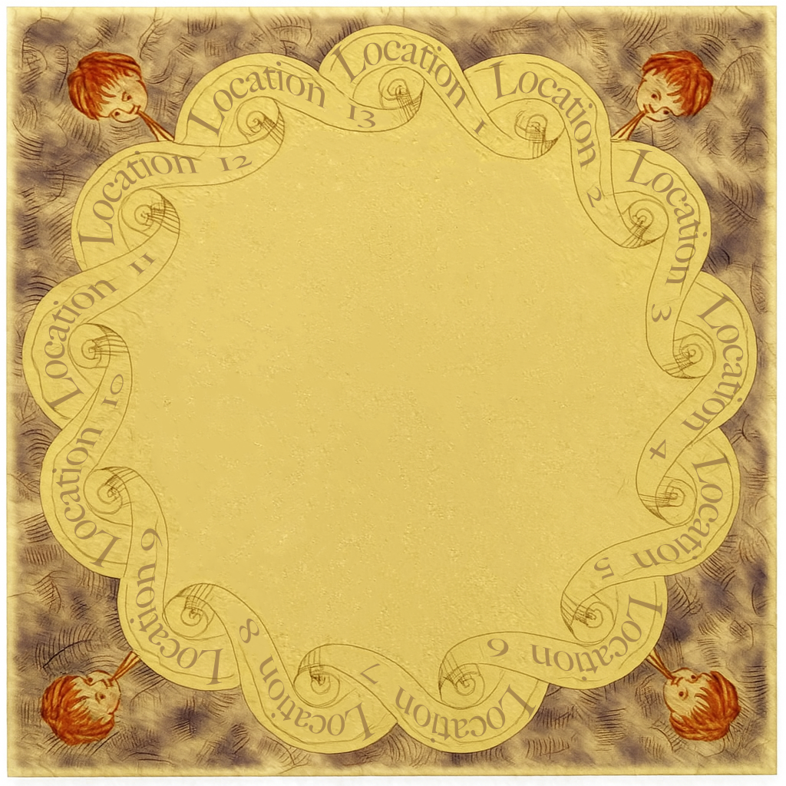

# Weasley Clock Custom Component


A complete solution for a Harry Potter style Location Clock in Home Assistant. It manages the logic, the mathematics, and the frontend display.


## 🎨 Asset Preparation (Graphics)
Before configuring the integration, you need to create your custom Clock Face and Hands.

**Clock Face Example:**  


**Clock Hand Example:**  


1.  **Edit the Design Files:**
    * This project includes design templates for the Clock Face and the Hands in the `TemplateFiles` folder.
    * You can edit these using **Affinity Photo**.
    * **Important Font Note:** If you want your text to match the original templates, please install the [Big Caslon Medium font](https://fontsgeek.com/fonts/big-caslon-medium?ref=readme) before editing.
    * **Customizing texts:** Open the image you want to modify, select the text component, and type the desired name (for the Clock Face locations or the family members).
    * **Saving components:** When saving from the main template file that contains all components, ensure you export *only* the specific component you need (e.g., a single hand), while strictly keeping the original canvas size. **For the clock hands, it is crucial to save them as `.png` with a transparent background.**
    * Customize the length or color of the Hands for each family member as needed.

2.  **Export Images:**
    * **Clock Face:** Export as `.jpg` or `.png`.
    * **Hands:** MUST be exported as `.png` with a **Transparent Background**.

3.  **Upload to Home Assistant:**
    * Use the File Editor addon or Samba to access your Home Assistant folders.
    * Navigate to the `/config/www/` folder.
    * Create a new folder, I would recommend it naming it: `weasley_clock`.
    * Upload your exported images here.
    * *Result:* Your files should be accessible at `/local/weasley_clock/reloj_weasley.jpeg`.

---

## ⚙️ Setup Guide

### 1. Initial Configuration (The Clock Face)
1.  Go to **Settings > Devices & Services > Add Integration**.
2.  Search for **Weasley Clock**.
3.  **Step 1:** You will be prompted to name your 13 clock positions.
    * *Important:* These names must match the text you wrote on your Affinity Clock Face template.
    * *Order:* The order corresponds to the clock hands moving clockwise from the top (12:00 position is usually "Home").

### 2. Adding a Person (The Hand)
To add a person, go to **Settings > Devices > Add Integration > Weasley Clock** again.
1.  **Name:** Enter the person's name (e.g., `Ron`). 
    * *Note:* This will create an entity named `sensor.ron_clockhand`.
2.  **Offset:** (Optional) Enter a number (e.g., `8`). This rotates the hand slightly so it doesn't cover other hands when in the same location.
3.  **Template:** Paste your Jinja2 logic here (see example below).

---

## 📝 Example Logic (Template)

**The Goal:**
We want to track "Ron Weasley". We want to use native Home Assistant Groups for family zones so we don't have to hardcode them.

**1. Create Helpers (Optional but Recommended):**
* Go to **Settings > Devices > Helpers > Create Helper > Group > Zone Group**.
* Name: `Family Houses`.
* Members: Select `zone.grandma`, `zone.parents`, etc.

**2. The Template Logic:**
Paste this into the "Template" field during setup.

```jinja
{# --- DEFINE VARIABLES --- #}
{# Change these entities to match your device #}





{# --- DEFINE GROUPS --- #}
{# We check if the current zone is inside our helper groups #}


{# --- LOGIC PRIORITY --- #}
{# The result MUST match one of the names you defined in Step 1 #}


  Mortal Peril

  In Bed

  Home

  Work

  Family

  Gym

  Traveling

  Lost

```

## 🖥️ Dashboard Card (Frontend)
Add a **"Manual"** card to your dashboard and paste this YAML. The weasley-clock-card is automatically installed by the integration.

**Note on Styling:** If your hands are different sizes, use the top, left, and width properties to align them perfectly with the center pivot point.

```YAML
type: custom:weasley-clock-card
image: /local/weasley_clock/reloj_weasley.jpeg
hands:
  # Hand 1: Ron
  - entity: sensor.ron_clockhand
    image: /local/weasley_clock/manecilla_ron.png
    width: 100%
    
  # Hand 2: Ginny (Example of custom sizing in CSS)
  - entity: sensor.ginny_clockhand
    image: /local/weasley_clock/manecilla_ginny.png
    width: 117%
    top: -8.5%
    left: -8.5%
```

## Updating to 1.1.0 / Actualización

Copy the complete `custom_components/weasley_clock` folder (including `translations`
and `www`) into `/config/custom_components/`, restart Home Assistant, and refresh
all browser/app pages. Existing hub and hand entries and entity IDs are preserved.
The file is named **weasley-card.js** and is served at
`/weasley_clock/weasley-card.js?v=1.1.0`. The integration loads it as a frontend
module automatically; it does not need to appear in the dashboard Resources list.
The card appears as **Weasley Clock** in the card picker and uses the YAML above.
If needed, register that URL manually as a JavaScript module and refresh the page.

En **Ajustes → Dispositivos y servicios → Weasley Clock**, pulsa **Configurar** en
el hub para editar las 13 posiciones. Pulsa **Configurar** en cada persona para
editar su nombre, desplazamiento y condiciones Jinja. Añade personas con
**Añadir integración → Weasley Clock** otra vez: crear el hub no añade personas
ni abre automáticamente sus condiciones. Cada persona tiene un dispositivo y
sensor vinculados al hub; el hub contiene un sensor con la lista de posiciones.
Si cambias una posición, actualiza las plantillas que devolvían el nombre anterior.

La tarjeta muestra el estado de las personas y un enlace **Configurar Weasley
Clock** a la integración. Puedes ocultarlos con `show_states: false` y
`show_configure: false`. Pulsa un estado para abrir la entidad. Una plantilla
inválida o una posición desconocida deja el sensor no disponible y añade el
motivo en `configuration_error`; la tarjeta oculta esa manecilla.


Template diagnostics also show `missing_entities`, `unavailable_entities`, and
`configuration_warning` on each hand and visibly in the card. Warnings update
when those entities change and do not invalidate a valid fallback location.
Only entity references accessed in the evaluated Jinja branch are checked;
unexecuted branches and arbitrary strings are not exhaustively validated.
